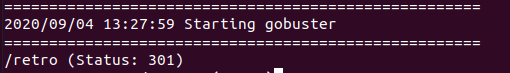
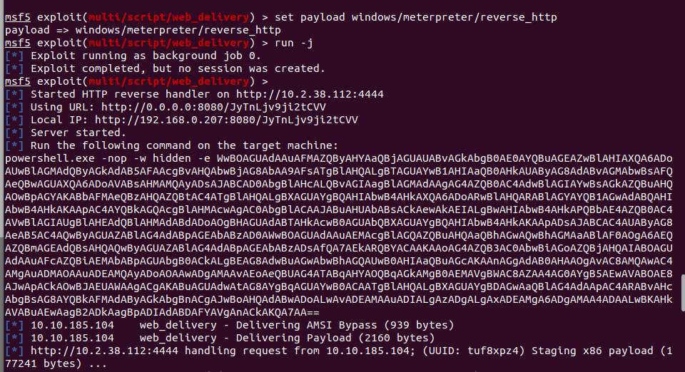

# Blaster - Windows box

Running an nmap scan of the box we find 6 ports open (for some reason THM wants the answer to be 2). 


*insert nmap scan*

We also see there is a web portal so I go visit this and am greeted with the below picture.

*insert web.png*


Many links that simply lead to other websites or absolutely nowhere. So i decide to run a gobuster scan and see what we can find.

*insert gobuster.png*

While waiting on the gobuster scan to find something useful I also ran another nmap scan this time with the --script vuln to find any possibly vulnerabilities. Our vuln scan unfortunately came back with nothing useful for us.

*insert vuln scan*

We find a directory called retro. When we navigate to it we are greeted by a website that seems to be about retro arcade games as well as other things.

*insert retro.png*

Searching through the website we see the authors name and take note of it as a possible user.

```
Wade:
```
We also find out that he has trouble logging in because he keeps mistyping his favorite book characters avatar name. This could possibly be his password.

*insert password.png*

```
Wade:Parzival
```
Returning to our nmap scan now that we have a potential username and password we find that we can use Windows Remote Desktop to try and log in. I used Remmima to do this because rdesktop would not work for me.

Once we log in we see a user.txt file on the desktop. We will copy and paste this to the final answer on Task 2.

*insert wade.png*

Task 3 now wants us to find a way further up the chain.

We search the file system and in the Recyle bin find a file. It turns out this is a deleted exe file named hhupd. When you google this file you find the vulnerability CVE-2019-1388. Having the file makes this easier to do, thus we restore it. It seems to need admin privilege to run however so more research is needed on how to run this.

*insert hhupd-restored.png*

We now need to research how to use this exe in our favor. I found a useful video which I followed on how to escalate our privileges using this exploit.

https://www.youtube.com/watch?v=3BQKpPNlTSo

After getting the exploit done and escalating our priveleges we can then navigate to the User/Administrator/Desktop folder and read root.txt

*insert root.png*


Now that we have that TryHackMe wants us to return to our machine and use metasploit to get in. So i will open a seperate terminal and start up msfconsole. We tell metasploit to use the given exploit and set it to target Powershell (set target 2). We also make sure our LHOST and LPORT is set.

We then set our payload to run 'windows/meterpreter/reverse_http' and run it as a job.

This spits out some nonsense that we need to copy and paste into the cmd on our remote desktop client with admin priveleges.

*insert payload.png*

Running this on our remote desktop will get us a meterpreter shell within metasploit. Which we can then setup persistance with. We do this by using this command within meterpreter.
```
run persistence -X - this gives us persistance and sets it up to run on reboot meaning unless found out we now have full access to this machine.
```

The room does let us know that we will need to set up a listener via the handler exploit in actual practice for persistence to work.


